<p align="center"><a href="https://github.com/Aldaviva/LaundryDuty">Washing Machine</a> &middot; <strong>Dryer</strong></p>

🧺 DryerDuty
===

[](https://github.com/Aldaviva/DryerDuty/actions/workflows/dotnet.yml) [![Testspace](https://img.shields.io/testspace/tests/Aldaviva/Aldaviva:DryerDuty/master?passed_label=passing&failed_label=failing&logo=data%3Aimage%2Fsvg%2Bxml%3Bbase64%2CPHN2ZyB4bWxucz0iaHR0cDovL3d3dy53My5vcmcvMjAwMC9zdmciIHZpZXdCb3g9IjAgMCA4NTkgODYxIj48cGF0aCBkPSJtNTk4IDUxMy05NCA5NCAyOCAyNyA5NC05NC0yOC0yN3pNMzA2IDIyNmwtOTQgOTQgMjggMjggOTQtOTQtMjgtMjh6bS00NiAyODctMjcgMjcgOTQgOTQgMjctMjctOTQtOTR6bTI5My0yODctMjcgMjggOTQgOTQgMjctMjgtOTQtOTR6TTQzMiA4NjFjNDEuMzMgMCA3Ni44My0xNC42NyAxMDYuNS00NFM1ODMgNzUyIDU4MyA3MTBjMC00MS4zMy0xNC44My03Ni44My00NC41LTEwNi41UzQ3My4zMyA1NTkgNDMyIDU1OWMtNDIgMC03Ny42NyAxNC44My0xMDcgNDQuNXMtNDQgNjUuMTctNDQgMTA2LjVjMCA0MiAxNC42NyA3Ny42NyA0NCAxMDdzNjUgNDQgMTA3IDQ0em0wLTU1OWM0MS4zMyAwIDc2LjgzLTE0LjgzIDEwNi41LTQ0LjVTNTgzIDE5Mi4zMyA1ODMgMTUxYzAtNDItMTQuODMtNzcuNjctNDQuNS0xMDdTNDczLjMzIDAgNDMyIDBjLTQyIDAtNzcuNjcgMTQuNjctMTA3IDQ0cy00NCA2NS00NCAxMDdjMCA0MS4zMyAxNC42NyA3Ni44MyA0NCAxMDYuNVMzOTAgMzAyIDQzMiAzMDJ6bTI3NiAyODJjNDIgMCA3Ny42Ny0xNC44MyAxMDctNDQuNXM0NC02NS4xNyA0NC0xMDYuNWMwLTQyLTE0LjY3LTc3LjY3LTQ0LTEwN3MtNjUtNDQtMTA3LTQ0Yy00MS4zMyAwLTc2LjY3IDE0LjY3LTEwNiA0NHMtNDQgNjUtNDQgMTA3YzAgNDEuMzMgMTQuNjcgNzYuODMgNDQgMTA2LjVTNjY2LjY3IDU4NCA3MDggNTg0em0tNTU3IDBjNDIgMCA3Ny42Ny0xNC44MyAxMDctNDQuNXM0NC02NS4xNyA0NC0xMDYuNWMwLTQyLTE0LjY3LTc3LjY3LTQ0LTEwN3MtNjUtNDQtMTA3LTQ0Yy00MS4zMyAwLTc2LjgzIDE0LjY3LTEwNi41IDQ0UzAgMzkxIDAgNDMzYzAgNDEuMzMgMTQuODMgNzYuODMgNDQuNSAxMDYuNVMxMDkuNjcgNTg0IDE1MSA1ODR6IiBmaWxsPSIjZmZmIi8%2BPC9zdmc%2B)](https://aldaviva.testspace.com/spaces/223055) [](https://coveralls.io/github/Aldaviva/DryerDuty?branch=master)

*Notify you when your dryer has finished a load of laundry by sending a PagerDuty alert.*

<!-- MarkdownTOC autolink="true" bracket="round" autoanchor="false" levels="1,2" bullets="1.,-,-,-" -->

1. [Behavior](#behavior)
1. [Prerequisites](#prerequisites)
1. [Circuit diagrams](#circuit-diagrams)
1. [Installation](#installation)
1. [Configuration](#configuration)
1. [Running](#running)
1. [Alerts](#alerts)
1. [Presentation](#presentation)
1. [References](#references)

<!-- /MarkdownTOC -->

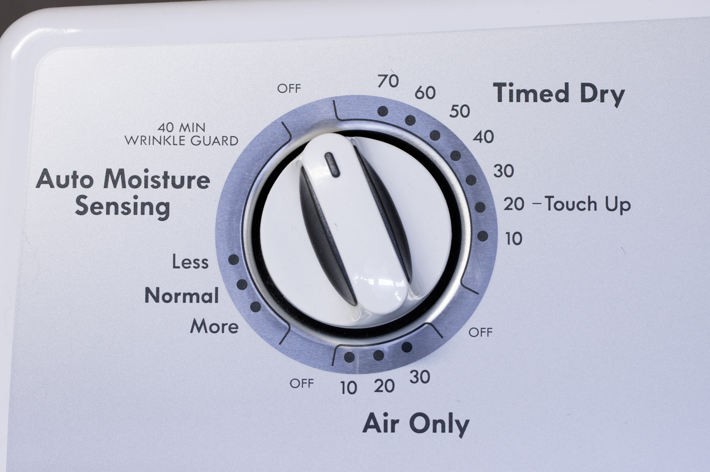

## Behavior

1. When you start a load of laundry in the dryer, an induction clamp sensor installed inside the dryer detects the increased current flowing from the start button to the motor.
1. A .NET daemon running on a Raspberry Pi reads the voltage from the induction sensor using an analog-to-digital converter, and sends a Change event to PagerDuty when the motor starts.
1. When the motor stops, the Raspberry Pi triggers an Alert in PagerDuty. This will notify you on your configured communications channels, like a push notification in the mobile app.
1. When you open the dryer door to remove the laundry, another induction clamp sensor detects the door light turning on, and the Raspberry Pi automatically resolves the Alert so you don't keep getting notifications.

## Prerequisites
- [Raspberry Pi 2 Model B rev 1.1](https://www.raspberrypi.com/products/) or later
    - [Raspberry Pi OS (Raspbian) Lite](https://www.raspberrypi.com/software/operating-systems/)
        - 32-bit or 64-bit
    - [USB Wi-Fi adapter](https://www.canakit.com/raspberry-pi-wifi.html), unless you have a Raspberry Pi 3 or later with built-in Wi-Fi
    - USB AC adapter with a sufficiently long cable to reach the top of the dryer
- [.NET Runtime 8 for Linux](https://dotnet.microsoft.com/en-us/download/dotnet) or later
    - ARM32 or ARM64
    - Neither Raspberry Pi nor Microsoft package repositories offer APT packages of .NET for ARM
    - You can install .NET using [my unofficial APT repository of .NET for Raspberry Pi](https://github.com/Aldaviva/RaspberryPiDotnetRepository), packaged from official Microsoft builds
        ```sh
        sudo wget -q https://raspbian.aldaviva.com/aldaviva.gpg.key -O /etc/apt/trusted.gpg.d/aldaviva.gpg
        echo "deb https://raspbian.aldaviva.com/ $(lsb_release -cs) main" | sudo tee /etc/apt/sources.list.d/aldaviva.list > /dev/null
        sudo apt update
        sudo apt install -y dotnet-runtime-latest
        ```
    - Alternatively, you can install .NET using Microsoft's [installation script](https://dotnet.microsoft.com/en-us/download/dotnet/scripts), but it won't update with APT or choose the latest version
        ```sh
        wget https://dotnet.microsoft.com/download/dotnet/scripts/v1/dotnet-install.sh
        sudo bash dotnet-install.sh --channel LTS --runtime dotnet --install-dir /usr/share/dotnet/
        sudo ln -s /usr/share/dotnet/dotnet /usr/bin/dotnet
        rm dotnet-install.sh
        ```
- [PagerDuty account](https://www.pagerduty.com/sign-up/) (the [free plan](https://www.pagerduty.com/sign-up-free/?type=free) is sufficient)
- Clothes dryer
    - [Kenmore 500 series 11065102310 240V 26A electric dryer](https://www.searspartsdirect.com/model/32k35liyt3-000582/kenmore-11065102310-dryer-parts)
    - The door light must be working for this program to detect when the door is opened, so you must replace the bulb if it has burned out.
    - Make sure you use the OEM-style [E12 incandescent light bulbs](https://www.amazon.com/dp/B07XNPL2RW) instead of [LED replacements](https://www.amazon.com/dp/B08K32T7Y2), because the LEDs don't draw enough current to be easily detectable.
- Current sensor circuit
    - <strong><a href="https://www.digikey.com/short/dzwtnnnf"> View all parts on Digi-Key</a></strong>
    - [YHDC 60 A voltage output current sensing clamp transformer](https://www.digikey.com/en/products/detail/seeed-technology-co-ltd/101990064/5487440) to non-invasively measure the motor's AC amperage and output a proportional AC voltage in the range [0,1] V
    - [YHDC 5 A voltage output current sending clamp transformer](https://www.digikey.com/en/products/detail/seeed-technology-co-ltd/101990058/5487435) for the door light AC amperage, which is much less than the motor current
    - [MCP3008 I/P 10-bit Analog-to-Digital Converter](https://www.digikey.com/en/products/detail/microchip-technology/MCP3008-I-P/319422) to convert the analog [0,1] V signals from the current transformers into digital [0,1023] values and send them over an SPI connection to the Raspberry Pi, which does not have its own built-in ADC
    - 2 × [3.5 mm TRS jacks](https://www.digikey.com/en/products/detail/kycon-inc/STX-3120-3B/9990113) to connect the current transformers to the rest of the circuit
    - 4 × [100 kΩ 0.5 W resistors](https://www.digikey.com/en/products/detail/yageo/CFR50SJT-52-100K/9099700) for the voltage dividers, which add voltage to the transformer signals so the unsigned ADC won't clip negative values to 0
    - 2 × [10 μF 50V aluminum electrolytic capacitors](https://www.digikey.com/en/products/detail/rubycon/50YXF10MEFCTA5X11/3567102) for the voltage dividers
    - [Breadboard](https://www.digikey.com/en/products/detail/adafruit-industries-llc/64/7241427) (easy, but loose connections are likely) or [perforated permanent-prototype board](https://www.digikey.com/en/products/detail/adafruit-industries-llc/1609/5353655) (requires soldering, but connections will be solid)
    - Wires or [jumper](https://www.adafruit.com/product/826) [cables](https://www.adafruit.com/product/758) to connect the components

## Circuit diagrams

### Current sensor

<table>
<thead>
<tr>
<th>Visual diagram</th>
<th>Schematic diagram</th>
<th>Photo</th>
</tr>
</thead>
<tbody>
<tr>
<td width="33%"></td>
<td width="33%"></td>
<td width="33%"></td>
</tr>
<tr>
<td colspan="3" align="center"><a href="Circuit/Current sensor.fzz"><strong>⬇️ Download Fritzing file</strong></a></td>
</tr>
</tbody>
</table>

### Dryer

<p>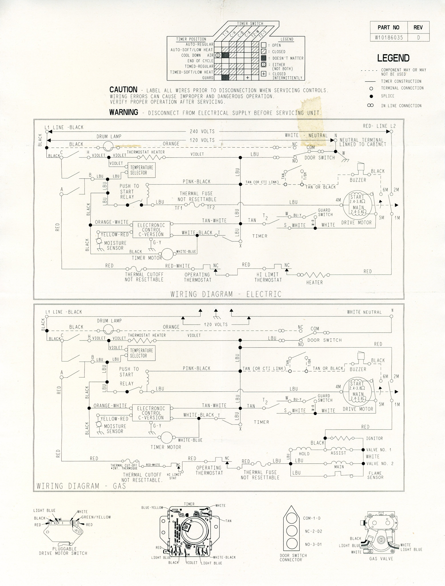</p>

The 60 A motor clamp sensor attaches to the light blue wire that connects the **Push To Start Relay** to the **Drive Motor**.

The 5 A light clamp sensor attaches to the orange wire that connects the **NC** terminal of the **Door Switch** to the **Drum Lamp**.

## Installation

### Hardware

1. Open the drum cabinet of the dryer by unscrewing the two Phillips screws on the lint trap, then prying up on the front edge of the top panel. There are two spring clips that hold it down in the front left and right corners. I used a plastic panel puller to lift the lid.

    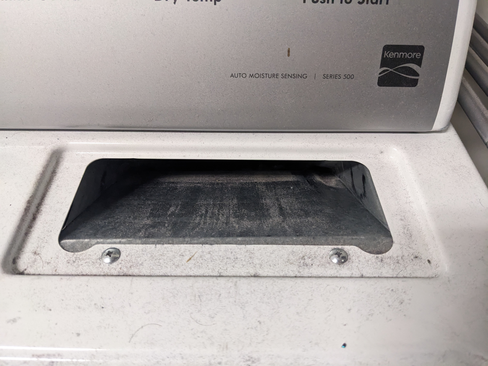

    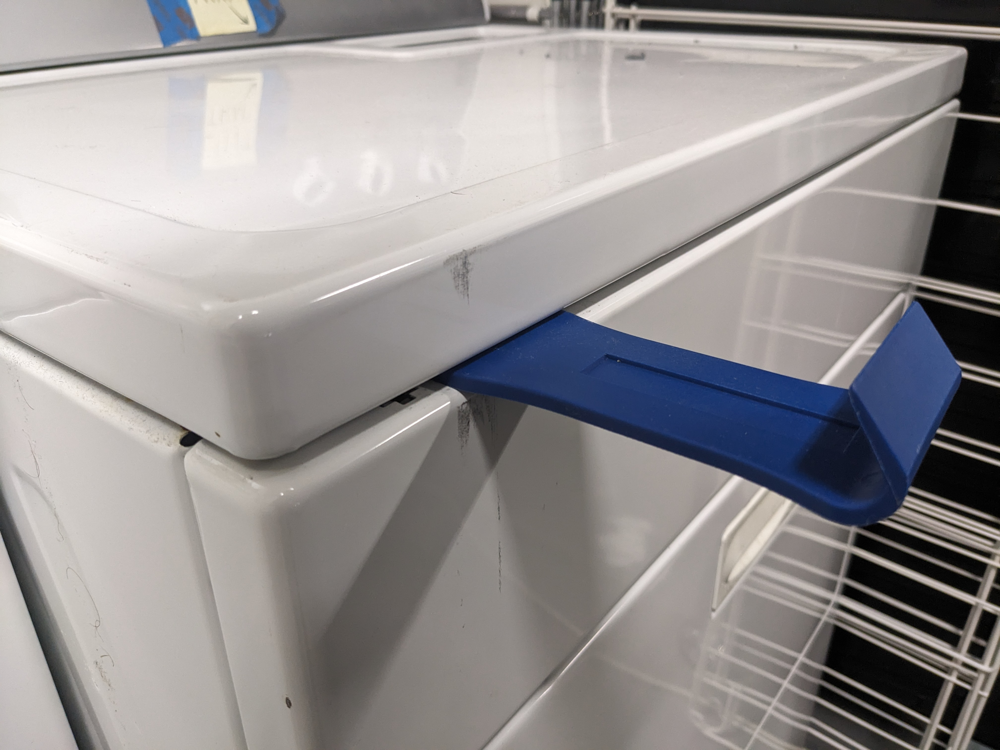
1. Clamp the 5 A current transformer around the orange wire that leads to the door switch on the right side of the cabinet.
    
    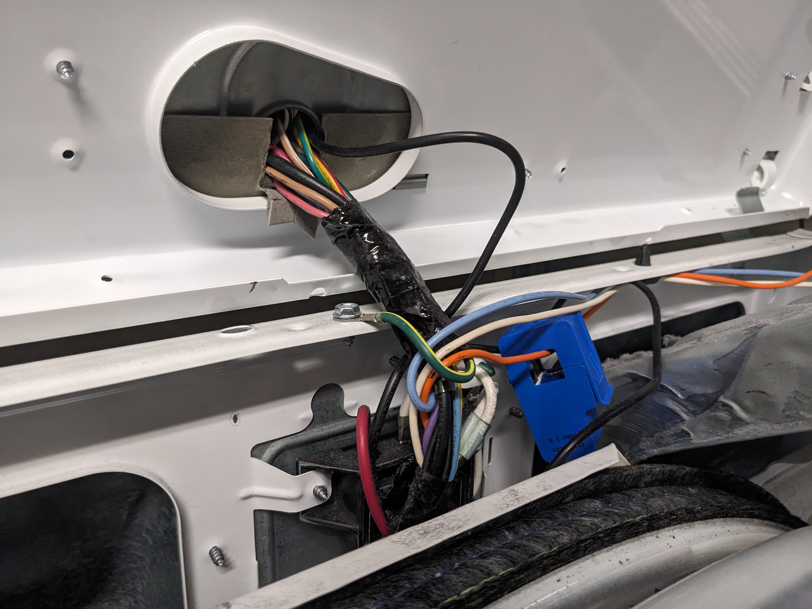
1. Run the end of the wire with the 3.5 mm TRS plug up into the hole in the back center of the lid that leads to the control panel.
1. Close the cabinet lid and replace the two lint trap screws.
1. Open the control panel by pushing straight in (not pulling up) under the front left and right corners with a panel puller to release the two spring clips. Pitch the control panel back and rest it on something.
    
    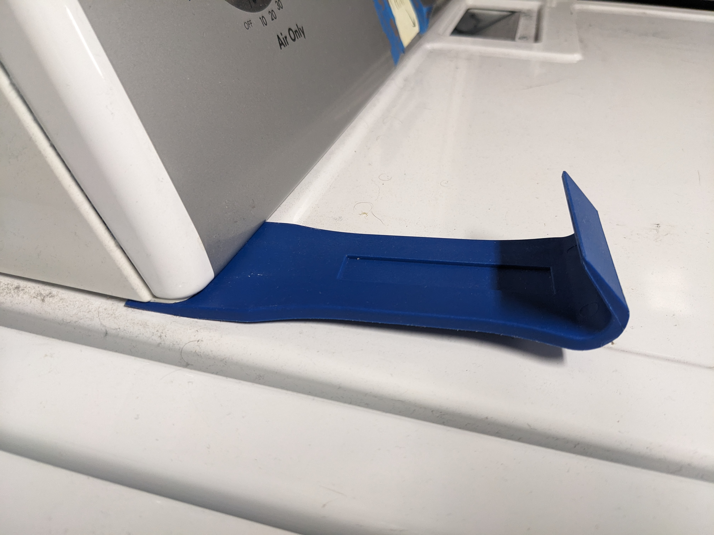

    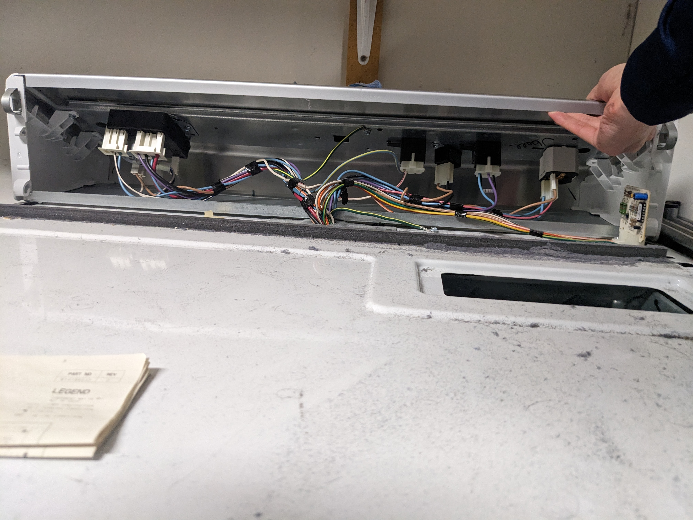
1. Clamp the 60 A current transformer around one of the two light blue wires leading to the Start button.

    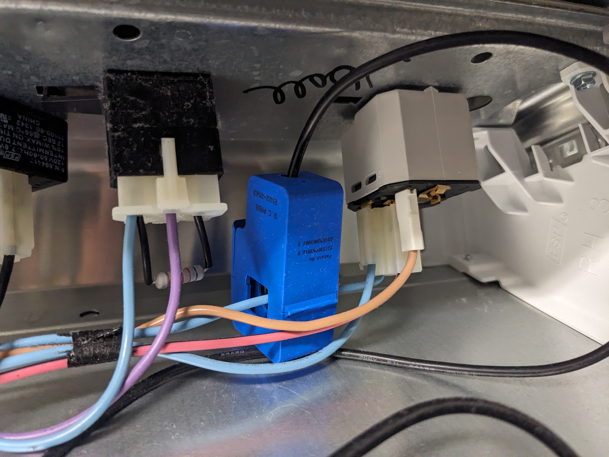
1. Place the Raspberry Pi, connected to the assembled current sensing circuit, underneath the control panel. You may need to stand the Raspberry Pi up on its edge so it will fit.
    
    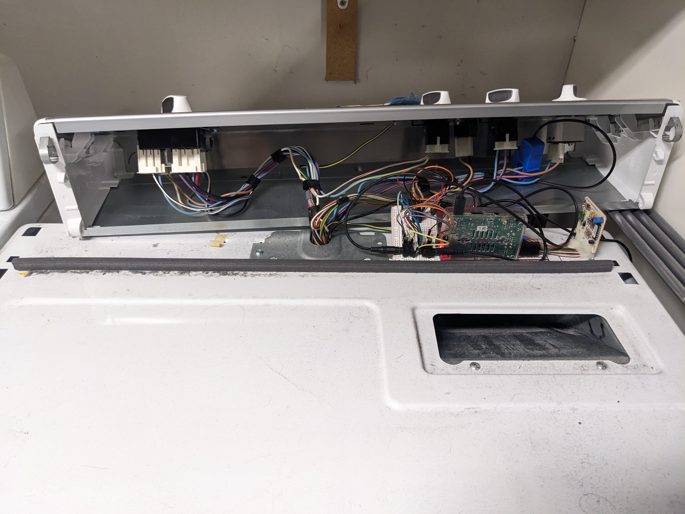
1. Connect the 3.5 mm TRS plug from the 60 A motor sensor (in the control panel) to the ADC Channel 0 (left) 3.5 mm jack in your circuit.
1. Connect the 3.5 mm TRS plug from the 5 A door light sensor (in the drum cabinet) to the ADC Channel 1 (right) 3.5 mm jack in your circuit.
1. Plug the Raspberry Pi into a USB AC power adapter and run the cable underneath the side of the control panel.

    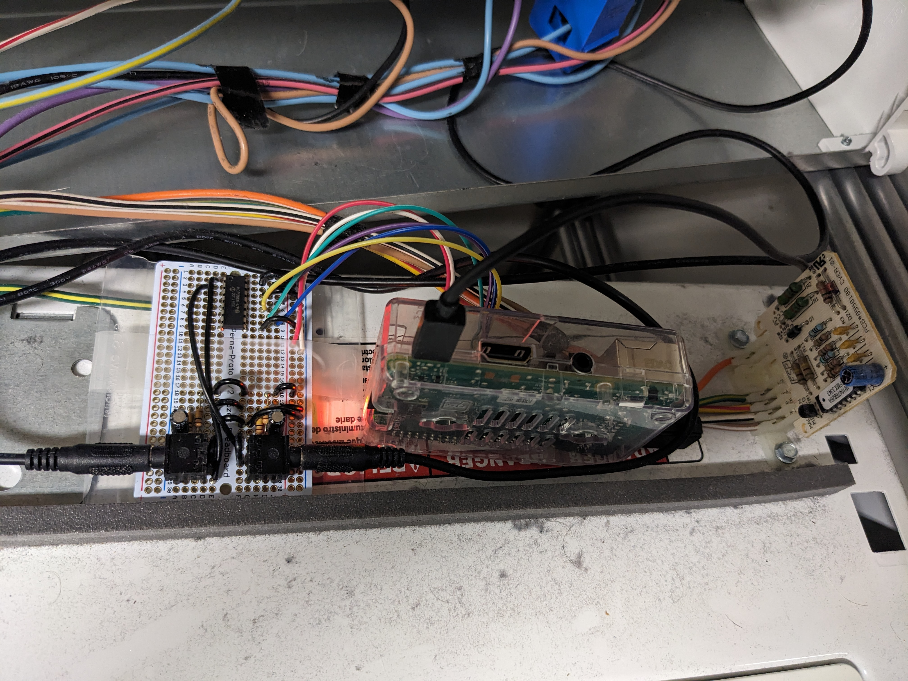
1. Check one final time that you can SSH into the Raspberry Pi.
1. Close the control panel.

### Software
1. Enable the [SPI](https://www.raspberrypi.com/documentation/computers/raspberry-pi.html#spi-overview) kernel module on your Raspberry Pi using `sudo raspi-config` › `3 Interface Options` › `I4 SPI`, then reboot.
1. Download the [`DryerDuty.zip`](https://github.com/Aldaviva/DryerDuty/releases/latest/download/DryerDuty.zip) file from the [latest release](https://github.com/Aldaviva/DryerDuty/releases/latest) to your Raspberry Pi.
    ```sh
    wget https://github.com/Aldaviva/DryerDuty/releases/latest/download/DryerDuty.zip
    ```
1. Extract the ZIP file to a directory like `/opt/dryerduty/`.
    ```sh
    sudo mkdir /opt/dryerduty
    sudo unzip DryerDuty.zip -d /opt/dryerduty
    rm DryerDuty.zip
    ```
1. Allow the program to be executed.
    ```sh
    sudo chmod +x /opt/dryerduty/DryerDuty
    ```
1. Install the SystemD service.
    ```sh
    # if you chose an installation directory that isn't /opt/dryerduty, edit ExecStart and WorkingDirectory in dryerduty.service
    sudo mv /opt/dryerduty/dryerduty.service /etc/systemd/system/
    sudo systemctl daemon-reload
    sudo systemctl enable dryerduty.service
    ```

## Configuration

### PagerDuty

Create an Integration in PagerDuty and get its Integration Key.

1. Sign into your [PagerDuty account](https://app.pagerduty.com/).
1. Go to Services › Service Directory.
1. Select an existing Service for which you want to publish events, or create a new Service.
1. In the Integrations tab of the Service, add a new Integration.
1. Under Most popular integrations, select Events API V2, then click Add.
1. Expand the newly created Integration and copy its **Integration Key**, which will be used to authorize this program to send Events to the correct Service.

### DryerDuty

DryerDuty is configured using `appsettings.json` in the installation directory.

- `pagerDutyIntegrationKey` is the Integration Key that PagerDuty gives you when you create a new Events API v2 Integration for one of your Services.
- `motorMinimumActiveAmps` is the minimum current, in amps, which would indicate that the dryer's motor is running.
    - My dryer's motor runs at 4.33 A, so I set this to `2.0`.
- `lightMinimumActiveAmps` is the minimum current, in amps, which would indicate that the light bulb in the drum turned on because the door was opened.
    - My 15 W bulb runs at 0.08 A, so I set this to `0.04`.
- `motorGain` is a coefficient which the motor current is multiplied by to get a more accurate value.
    - The default value is `1.0`, but I had to set mine to `1.64` to match the current readings from my [clamp multimeter](https://www.kleintools.com/catalog/clamp-meters/acdc-digital-clamp-meter-auto-ranging-400-amp).
- `lightGain` is a coefficient which the light bulb current is multiplied by to get a more accurate value.
    - The default value is `1.0`, but I had to set mine to `0.75` to match the nominal current of my bulb.
- `Logging.LogLevel` controls the log verbosity, where the key is the namespace and the value is the [log level](https://learn.microsoft.com/en-us/dotnet/api/microsoft.extensions.logging.loglevel?view=dotnet-plat-ext-7.0) name.
    - To see current readings from this library, set `Logging.LogLevel.DryerDuty` to `Trace` and run `/opt/dryerduty/DryerDuty` from the command line.

## Running

### Restart the service

```sh
sudo systemctl restart dryerduty.service
```

### Check status

```sh
sudo systemctl status dryerduty.service
🟢 dryerduty.service - DryerDuty
     Loaded: loaded (/etc/systemd/system/dryerduty.service; enabled; vendor preset: enabled)
     Active: active (running) since Sat 2023-09-23 01:21:11 PDT; 2h 44min ago
   Main PID: 340 (DryerDuty)
      Tasks: 19 (limit: 1714)
        CPU: 3min 25.970s
     CGroup: /system.slice/dryerduty.service
             └─340 /opt/dryerduty/DryerDuty

Sep 23 01:21:03 dryer systemd[1]: Starting DryerDuty...
Sep 23 01:21:10 dryer DryerDuty[340]: DryerDuty.DryerMonitor[0] Timers started
Sep 23 01:21:11 dryer DryerDuty[340]: Microsoft.Hosting.Lifetime[0] Application started. Hosting environment: Production; Content root path: /opt/dryerduty
Sep 23 01:21:11 dryer systemd[1]: Started DryerDuty.
```

### View logs

```sh
sudo journalctl -f -u dryerduty.service
-- Journal begins at Tue 2023-05-02 17:25:51 PDT, ends at Sat 2023-09-23 04:06:51 PDT. --
Sep 23 01:21:03 dryer systemd[1]: Starting DryerDuty...
Sep 23 01:21:10 dryer DryerDuty[340]: DryerDuty.DryerMonitor[0] Timers started
Sep 23 01:21:11 dryer DryerDuty[340]: Microsoft.Hosting.Lifetime[0] Application started. Hosting environment: Production; Content root path:>
Sep 23 01:21:11 dryer systemd[1]: Started DryerDuty.
```

## Alerts

1. When the dryer starts running, this program will send a Change event to PagerDuty with the summary
    ```text
    The dryer is starting a load of laundry.
    ```

1. When the dryer completes the load, this program will trigger a new Alert at the Info severity, with the summary
    ```text
    The dryer has finished a load of laundry.
    ```

    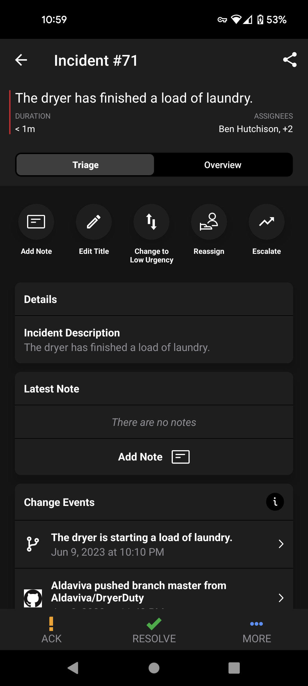 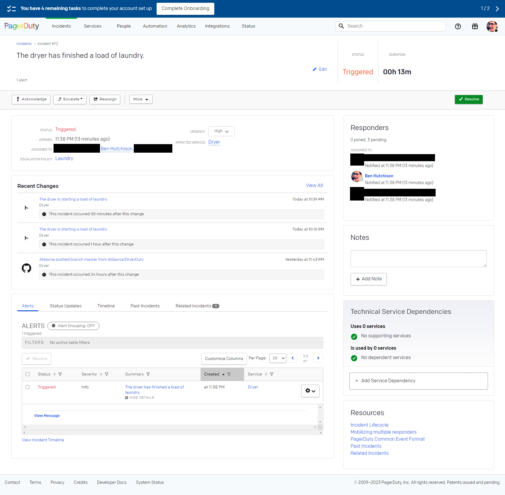
1. When the dryer door is opened after it finishes a load, this program will automatically resolve the previously created Alert. You can also manually resolve the Alert from the PagerDuty web or mobile apps.

## Presentation

I gave a talk about this project for PagerDuty's 2024-02-09 How-To Happy Hour on their [Twitch channel](https://twitch.tv/pagerduty).

- [🎞 Video recording](https://www.youtube.com/watch?v=0Gui4cGQ2ds)
- [💡 Community spotlight](https://www.pagerduty.com/blog/community-spotlight-ben-hutchison/)

[](https://www.youtube.com/watch?v=0Gui4cGQ2ds)

## References
- [command-tab/brewbot (Collin Allen)](https://github.com/command-tab/brewbot)
- [SCT-013 Split Core Current Transformer (InnovatorsGuru)](https://innovatorsguru.com/sct-013-000/)
- [MCP3xxx family of Analog to Digital Converters (Microsoft)](https://github.com/dotnet/iot/blob/main/src/devices/Mcp3xxx/README.md)
- Adafruit
    - [Analog Inputs for Raspberry Pi Using the MCP3008](https://learn.adafruit.com/reading-a-analog-in-and-controlling-audio-volume-with-the-raspberry-pi/overview)
    - [Raspberry Pi Analog to Digital Converters](https://learn.adafruit.com/raspberry-pi-analog-to-digital-converters)
    - [MCP3008 - 8-Channel 10-Bit ADC With SPI Interface](https://learn.adafruit.com/mcp3008-spi-adc/python-circuitpython)
- SparkFun
    - [30A Non-Invasive Current Sensor](https://www.sparkfun.com/products/11005) [reviews](https://www.sparkfun.com/products/11005#reviews)
    - [Current Sensor Breakout (ACS723) Hookup Guide](https://learn.sparkfun.com/tutorials/current-sensor-breakout-acs723-hookup-guide)
- OpenEnergyMonitor
    - [CT sensors - An Introduction](https://docs.openenergymonitor.org/electricity-monitoring/ct-sensors/introduction.html)
    - [Current Transformer Installation](https://docs.openenergymonitor.org/electricity-monitoring/ct-sensors/installation.html)
    - [CT Sensors - Interfacing with an Arduino](https://docs.openenergymonitor.org/electricity-monitoring/ct-sensors/interface-with-arduino.html)
    - [How to build an Arduino energy monitor - measuring mains voltage and current](https://openenergymonitor.github.io/forum-archive/node/58.html)